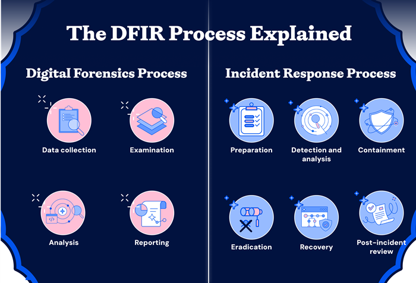

# Forensic investigation methodology

[Digital forensics](https://www.nist.gov/digital-evidence) is the field of forensic science concerned with **retrieving, storing and analyzing** data that can be useful in investigations.

This includes information retrieved from servers, workstations, mobile phones, IoT devices, motor vehicles, drones, satellites or the cloud.

The main goal is to identify the **root cause** of an incident.

## A 10 step investigation methodology

The general approach of this methodology is the analysis of digital evidence to prove or disprove a hypothesis. [1]

It starts with identification and scoping, evidence collection, analysis, normalization and correlation, building a timeline, analysing the kill chain and reporting.

 
*image source: Digital Forensics and Incident Response by Gerard Johansen*

Note not all incidents require a full 10 step methodology, knowing when to triage and when to deep-dive saves time and resources.

Triage is a rapid high-level assessment, used then time pressure demands immediate containment.
The goal is scoping: is this a real incident or a false positive, what systems are affected?
The result is enough information to decide whether to escalate or not.

A full investigation is a complete, documented and legally defensible process.
Performed when the incident is a true positive, when law enforcement or regulatory notification may be required, or litigation is anticipated.

## DFIR

The term **DFIR** (Digital Forensics and Incident Response) is often used referring to the broader discipline including incident response. 

This track focuses on the **Digital Forensics** process. 
For those seeking more info on **Incident Response**, refer to the [NIST Special Publication 800-61r3](https://csrc.nist.gov/pubs/sp/800/61/r3/final). [2] 

  
*image source: WIZ*

## Phases of the [digital forensic process](https://www.unodc.org/cld/en/education/tertiary/cybercrime/module-4/key-issues/standards-and-best-practices-for-digital-forensics.html)

According to the standards and best practices for digital forensics published by [ISO](https://www.iso.org/home.html) (International Organization for Standardization) and [IEC](https://www.iec.ch/) (International Electrotechnical Commission) as ISO/IEC 27037 [3], the phases are:

- identification
- collection
- acquisition
- preservation

The following phases are part of the forensic process, though not included in the ISO/IEC standards:

- analysis
- reporting

## Evidence

A key principle in forensics is **Locard's principle of exchange**, often summarized as "every contact leaves a trace". 
It states that when a criminal comes in contact with an object, or a person, a cross-transfer of **evidence** occurs. 
When faced with massive amounts of artifacts, this principle reminds us that, if an attack happened, evidence of the intrusion is there.

We just have to find it.

There is no such thing as undetectable and no such thing as unhackable.

Main ***types of evidence*** retrieved and analyzed:

- disk (files, logs, command history, browser artifacts, etc.)
- memory (process, linked libraries, network connections, etc.)
- network (pcaps, netflow, zeek logs, etc.)

### Indicators of compromise

IoCs represent evidence that an attacker has breached an entity’s network or endpoint. 
Indicators may be email based, network, host or behavioural.
They may include:

- unusual network traffic
- suspicious file hashes
- malicious IPs/domains
- suspicious login failures
- unauthorized changes to system configurations, and more

IoCs can be:

- atomic (IPs, domain names that tie back to an adversary C2 infrastructure)
- computed (hashes)
- behavioural (patterns of activity that indicate malicious intent, ex. `base64` encoded powershell execution)

Atomic IoCs age quickly.
An IP used today may be reassigned or abbandoned in a few hours.

Behavioural IoCs, or TTPs are valid for longer because changing behaviour requires the adversary to retrain, retool or restructure their operations.

This is sometimes called the [Pyramid of Pain](https://detect-respond.blogspot.com/2013/03/the-pyramid-of-pain.html): the higher an IoC sits, the more it costs the adversary to change it.

## Diamond model

The Diamond Model is a framework for the analysis of intrusions.
It states:

> *"For every intrusion event, there exists an adversary taking a step toward an
> intended goal by using a capability over infrastructure against a victim."*

The relationships between the components of an attack lead to the building of the model associated with the intrusion.

 
*[The Diamond Model of Intrusion Analysis](https://www.researchgate.net/publication/379381999_The_Diamond_Model_of_Intrusion_Analysis) by Sergio Caltagirone, Andrew Pendergast, Cristopher Betz*

The four components are:

### Adversary

The threat actor behind the intrusion: an individual, group, or organization seeking to compromise a system or network to further their goals.

### Capability

The tools, techniques, and procedures (TTPs) the adversary uses to carry out the attack. 
This includes malware, exploits, scripts, and living-off-the-land techniques.

### Infrastructure

The physical and virtual resources the adversary uses to deliver their capability to the victim. 
This includes C2 servers, domains, IP addresses, compromised third-party systems, and communication channels such as RDP or VPN.

### Victim

The target of the intrusion: an organization, network, system, or individual.

The model shows the **relationships** between components. 
Knowing one component allows investigators to pivot: a known IP (infrastructure) can reveal other victims, a malware hash (capability) can surface related campaigns, a victim profile can predict future targets. 

The cases below show the model in practice.

## Case examples

[Cat's Got Your Files: Lynx Ransomware](https://thedfirreport.com/2025/11/17/cats-got-your-files-lynx-ransomware/)

- initial access: RDP with compromised credentials to internet-exposed system
- internal recon: enumerate virtual infrastructure and file shares using standard windows utilities and [netscan](https://www.softperfect.com/products/networkscanner/), then [NetExec](https://github.com/Pennyw0rth/NetExec)
- lateral movement: to Domain Controller via separate compromised domain account (likely obtained from initial access broker)
- persistence: create new accounts via [dsa.msc](https://learn.microsoft.com/en-us/windows-server/identity/ad-ds/manage-user-accounts-in-windows-server), install AnyDesk client
- privilege escalation: add new accounts to privileged groups
- exfil: sensitive files from network shares, 7z compressed via temporary file service [temp.sh](http://temp.sh)
- c2: RDP, AnyDesk (installed but not used)
- ransomware deployment: delete backup jobs, deploy lynx across multiple backup and file servers via RDP 

*image source: the DFIR Report*

[From a Single Click: How Lunar Spider Enabled a Near Two-Month Intrusion](https://thedfirreport.com/2025/09/29/from-a-single-click-how-lunar-spider-enabled-a-near-two-month-intrusion/)

- initial access: JavaScript file disguised as tax form, downloads and executes Brute Ratel via MSI installer
- internal recon: standard windows utilities, ADFind, rustscan, powerview
- lateral movement: PsExec, custom tool using Zerologon (CVE-2020-1472), RDP
- persistence: registry Run key named Update executing Brute Ratel badger, custom .NET backdoor via scheduled task, setup an additional C2 channel
- privilege escalation: Windows’ Secondary Logon service to enable runas with admin credentials found in `unattend.xml` file, UAC bypass via Cobalt Strike [uac-token-duplication](https://hstechdocs.helpsystems.com/manuals/cobaltstrike/current/userguide/content/topics/post-exploitation_privilege-escalation.htm)
- exfil: Rclone, FTP
- c2: Latrodectus/BackConnect VNC, Brute Ratel, `lsassa.exe` `.NET` malware, metasploit, Cobalt Strike
- credential harvesting: lsass, Latrodectus stealer module extracted from Outlook by querying registry keys, `unattend.xml` file, [.ps1 file](https://github.com/sadshade/veeam-creds) targeting backup software Veeam 

*image source: the DFIR Report*

## Investigator's challenges

**Digital forensic investigators** face challenges such as:

- extracting data from damaged devices
- locating evidence among vast quantities of data
- ensuring that their methods capture data **reliably**, without altering it in any way

## Chain of custody

Preserving the integrity of the evidence (preventing alteration or deletion) is prioritized.

**Chain of custody** is used to track evidence by documenting each person and organization who handles it, the date/time it was collected or transferred, and the purpose of the transfer. [4]

Example [chain of custody form](https://www.oreilly.com/library/view/implementing-digital-forensic/9780128045015/XHTML/B9780128044544150142/B9780128044544150142.xhtml): 

 
*image source: Implementing Digital Forensic Readiness by Jason Sachowski*

## Summary

- digital forensics includes retrieving, storing and analyzing data
- DFIR includes incident response, out of scope for this track
- phases: identify, collect, acquire, preserve, analyze, report
- evidence sources: disk, memory, network
- DFIR case reports provide examples
- investigator's challenges: extraction, finding evidence in large amounts of data, reliability
- chain of custody is a priority

## Drills

### sketchy-trail

The first responder swears this crime-scene photo is clean, nothing but pixels.
Does the investigator think the same?

### silly-warden

Evidence Item #002: a chain-of-custody form, scanned and filed.
Looks complete, every handoff signed, but what's it hiding?

### ice-miner

What's that over there, deep underground?

### eye-ok

Threat intel dumped a pile of indicators on your desk, all jumbled together.
Can you tell a coherent story based on that?

## References & further reading

[1] Digital Forensics and Incident Response, chapter 4. Investigation methodology, section "Functional digital forensic investigation methodology" by Gerard Johansen 
[2] [NIST Special Publication 800-61r3](https://csrc.nist.gov/pubs/sp/800/61/r3/final) 
[3] ISO/IEC 27037:2012  
[4] [Chain of custody](https://www.cisa.gov/sites/default/files/publications/cisa-insights_chain-of-custody-and-ci-systems_508.pdf) 
[+] [Overview of Digital Forensics, ISACA](https://www.isaca.org/resources/white-papers/overview-of-digital-forensics) 
