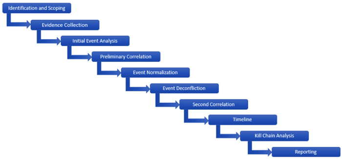
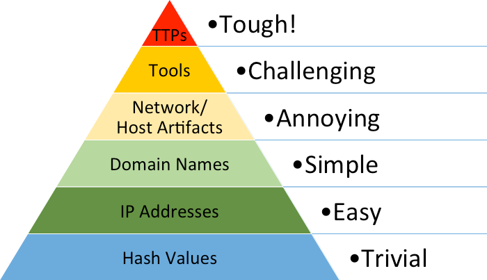
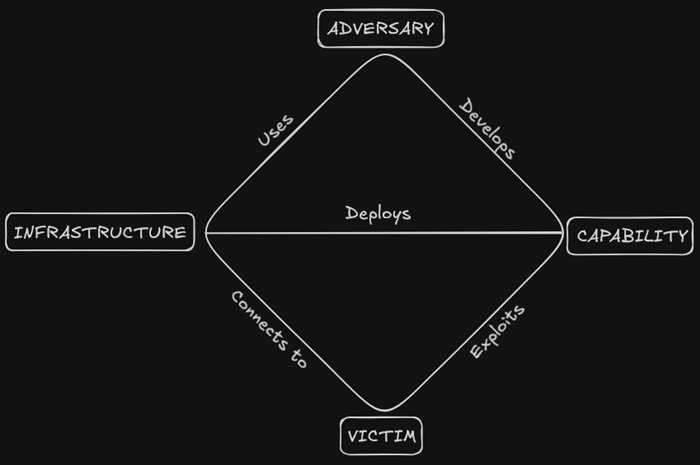
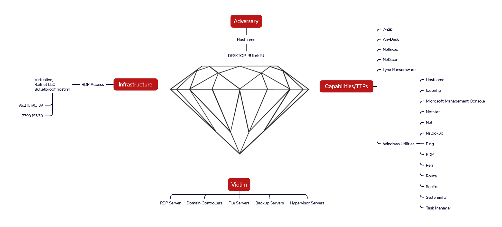
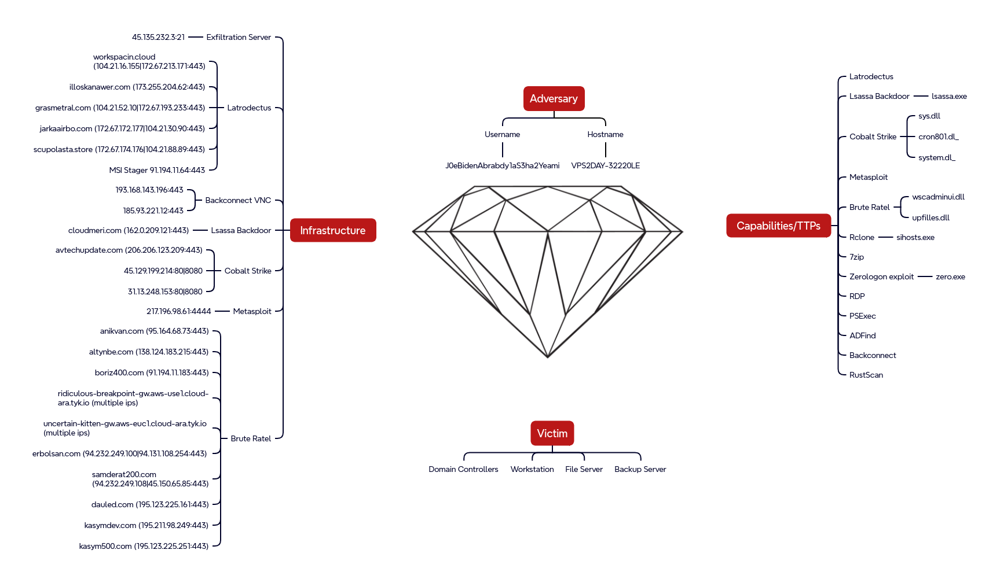
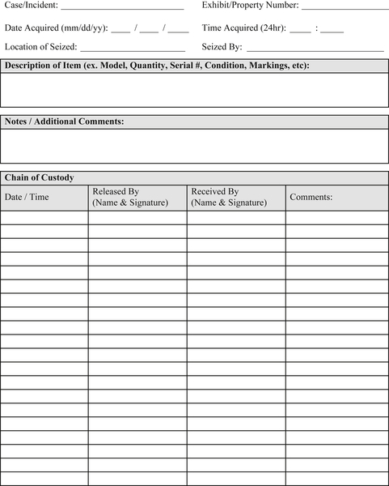

# FORENSIC INVESTIGATION METHODOLOGY

---

## WHAT IS DIGITAL FORENSICS?

---

## WHERE DO WE COLLECT ARTIFACTS FROM?

---

## WHY IS A DIGITAL INVESTIGATOR CALLED IN?

---

## 10 STEP INVESTIGATION METHOGOLOGY



---

## Triage vs Full investigation

---

## DFIR

---

## DFIR


---

## PHASES OF THE DIGITAL FORENSIC PROCESS (ISO/IEC)

``` [1 - 4 | 5 - 9]
* identification
* collection
* acquisition
* preservation

# The following phases are part of the forensic process
# though not included in the ISO/IEC standards:
* analysis
* reporting
```

---

## Locard's principle of exchange

"Every contact leaves a trace"

---

## WHAT TYPES OF EVIDENCE?

---

## IOCs

---

## IOCs

* atomic
* computed
* behavioural

---

## PYRAMID OF PAIN



---

## DIAMOND MODEL



---
## LYNX RANSOMWARE



---
## LUNAR SPIDER



---
## INVESTIGATOR'S CHALLENGES

- extracting data from damaged devices
- locating evidence among vast quantities of data
- ensuring that their methods capture data **reliably**, without altering it in any way

---
## CHAIN OF CUSTODY



---
## SUMMARY

``` [1 | 2 | 3 | 4 | 5 | 6 | 7]
digital forensics includes retrieving, storing and analyzing data
DFIR includes incident response, out of scope for this track
phases: identify, collect, acquire, preserve, analyze, report
evidence sources: disk, memory, network
DFIR case reports provide examples
challenges: extraction, large amounts of data, reliability
chain of custody is a priority
```
---
## QUESTIONS
