# File Systems

All computer applications need to store and retrieve information.
Magnetic disks have been used for years for this long-term storage.
But solid-state drives have become popular as they offer fast random access.

Think of a disk as a sequence of fixed-size blocks supporting two operations:

a) Read block k.<br />
b) Write block k.<br />

These are very inconvenient operations, especially on large systems used by multiple applications and users.
A few questions that arise:

- How do you find information?
- How do you keep one user from reading another user’s data?
- How do you know which blocks are free? [1] <br />

Enter: **the file**. <br />
<br />
The part of the operating system dealing with files is the **file system**.

## Prerequisites

- a unix forensic vm with
  - TSK
  - nice to have but not mandatory
    - UAC outputs
- a windows forensic vm with
  - nice to have but not mandatory
    - KAPE outputs
    - Timeline Explorer

## Files

A file is an abstraction, that gives a way to store data on the disk and read it, shielding the user from the details data storage. <br />

- files may have extensions
  - in Unix like systems, extensions are just conventions, not enforced by the OS
  - in Windows systems, extensions are assigned meaning
- file is just a sequence of bytes, but the OS will execute a file based on its format
  - for example, an executable has five sections: header, text, data, relocation bits, and symbol table
    - the _header_ starts with a so-called _magic number_, identifying the file type
    - after the header are the _text_ and _data_ of the program itself
    - these are loaded into memory and relocated using the _relocation bits_
    - the _symbol table_ is used for debugging<br />

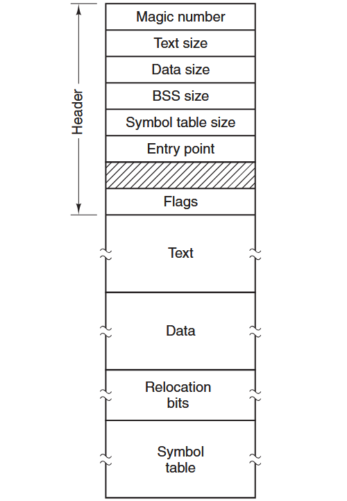<br />
_image source: Modern Operating Systems by Andrew Tanenbaum_

## Directories

To keep track of files, file systems have directories, which are themselves files.
When the file system is organized as a directory tree, filenames are specified by one of two methods:

- **absolute path** names always start at the root directory and are unique
  - in UNIX the components of the path are separated by / (forward slash), in Windows the separator is \ (backslash).
    - the same path name would be:
      - UNIX `/usr/sss/forensics`
      - Windows `\usr\sss\forensics`

- **relative path** names, relative to the current working directory

## EXT4

The newest version of an old Unix file system.<br />
Similar flavors include FFS (BSD) and UFS (Solaris).<br />
Other Unix file systems include ZFS, or BTRFS, but forensic support is still limited for them.<br />

### Layers

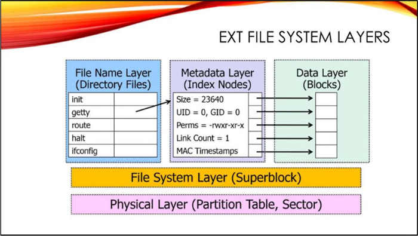<br />
_image and layers source: Hal Pomeranz' Linux Forensics_

- **Physical Layer**: The physical drive or device and the partitions on it.
  - linux systems often use the old DOS Master Boot Record (MBR) style partitions with four "primary" partitions and chained "extended" (logical) partitions as necessary. GPT (GUID Partition Tables) is a newer disk partitioning scheme designed to overcome the limitations of MBR, and may be found on some Linux systems
  - even though multiple partitions may exist on the same disk, the Unix operating system treats them as independent devices and performs file I/O via individual entries in the `/dev` directory (`/dev/sda1`, `/dev/sda2`)
- **File System Layer**: Contains all the config and management data associated with the file systems in each partition on the disk
  - when a file system is created in a partition, a data structure is created at the beginning of the partition to define the attributes of the file system; this is called a **superblock**, and it contains:
    - file system type/size, block size, number of blocks/inodes, etc.
    - modification time, last mounted on, clean/dirty status
    - pointer to inode for file system journal

- **Filename Layer** (AKA Human Interface Layer): responsible for mapping human readable filenames to metadata addresses
  - **directory files** associate _filenames_ to index node (_inode_) numbers in the layer below
  - directories give the file system its hierarchical structure

- **Metadata Layer**: Contains inodes, the data structures responsible for definition and delineation of files
  - every file has an inode that contains:
    - file type
    - access rights
    - owners
    - timestamps
    - size
    - pointers to data blocks
  - inodes store everything about the file that you see in the output of `ls -l` except the filename

- **Data Layer**: stores actual file contents, referred to as blocks in Unix file systems (Windows file systems use the term _clusters_ instead)
  - blocks are composed of sectors (usually 8 in EXT)
    - sectors are the smallest addressable unit of file I/O (usually 512 bytes)
    - to improve performance, EXT normally performs reads/writes in 4K chunks called blocks (512 x 8 = 4096)
  - blocks that make up a file are allocated consecutively when possible
  - blocks are organized into Block Groups of 32K blocks
  - each block group contains inodes and data blocks

On a disk we can find: allocated files, deleted files, unallocated space, and slack space.

When a file is deleted in EXT4, the operating system does not overwrite or delete the file's data blocks.<br />
It only marks the inode as free and removes the directory entry that mapped the filename to that inode.<br />
The data blocks themselves are marked as available, but their contents remain on disk until the OS overwrites them with new data.

**Unallocated space** means the filesystem deems those blocks free to be written, not necessarily empty.

**Slack space** means the space left after a file has been allocated.<br />
When a file is written, it usually doesn't occupy exactly the number of bytes in a block.

When we write a 3000 byte file on a filesystem where the blocksize is 4096, there are 1096 bytes of slack space.<br />
Its forensic value is that it can contain fragments of deleted files that had been stored in the same location.

### Directory structure

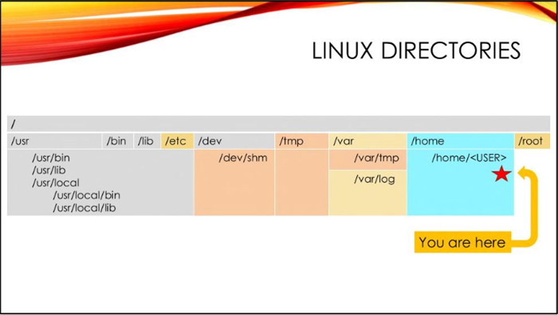 <br />
_image: Hal Pomeranz' Linux Forensics_

## NTFS

New Technology File System (NTFS) is the default file system for modern Windows-based operating systems.<br />
Formatting a volume with NTFS results in the creation of several system metadata files that store information about all files and folders on the NTFS volume:

- **$MFT** (Master File Table)
- **$LogFile**
- **$UsnJrnl**
- **$Boot**
- **$Bitmap**
- and others.

### Layout

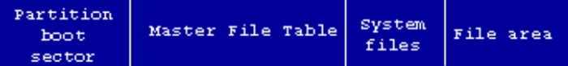<br />
_image source: `ntfs.com`_

- an NTFS volume starts with the Partition Boot Sector (**$Boot** metadata file), beginning at sector 0 and can be up to 16 sectors<br />
- `$Boot` describes NTFS volume information (bytes per sector, sectors per cluster, etc) and the location of the $MFT

``` powershell
Line	Tag	Entry Point	Signature	Bytes Per Sector	Sectors Per Cluster	Cluster Size	Reserved Sectors	Total Sectors	Mft Cluster Block Number	Mft Mirr Cluster Block Number	Mft Entry Size	Index Entry Size	
1	Unchecked	0xEB 0x52 0x90	NTFS    	512	8	4096	0	132157439	786432	2	1024	4096 [..]
```

- `$MFT` is the main metadata file, each file in the NTFS volume is represented by a record in this table

``` powershell
Line	Tag	Entry Number	Sequence Number	Parent Entry Number	Parent Sequence Number	In Use	Parent Path	File Name	Extension	Is Directory	Has Ads	Is Ads	File Size	Created0x10	Created0x30	Last Modified0x10	Last Modified0x30	Last Record Change0x10	Last Record Change0x30	Last Access0x10	Last Access0x30	Zone Id Contents
182845	Unchecked	151957	6	171992	2	Checked	.\$Recycle.Bin\S-1-5-21-3757327896-2532397730-150904874-1001	$IHVBCBC.exe	.exe	Unchecked	Unchecked	Unchecked	98	2026-06-12 12:35:56		2026-06-12 12:35:56		2026-06-12 12:35:56		2026-06-23 12:55:21	2026-06-12 12:35:56	[..]
```

<br />
_image source: `ntfs.com`_

### Directory structure

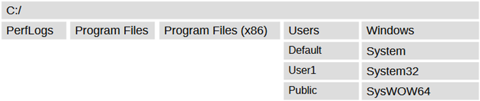

### Data streams

NTFS supports multiple data streams:

- a stream name identifies a new data attribute on the file
- a handle can be opened to each data stream

``` powershell
# we create a file and check its content and size
PS C:\Users\test1> echo "totallynormalbytes" > normal.txt
PS C:\Users\test1> cat .\normal.txt
totallynormalbytes
PS C:\Users\test1> ls .\normal.txt
    Directory: C:\Users\test1
Mode                 LastWriteTime         Length Name
----                 -------------         ------ ----
-a----         6/24/2026   9:52 AM             42 normal.txt
# we create an alternate data stream and check the content and size
# they are the same as before, the ads isn't accounted for
PS C:\Users\test1> Set-Content .\normal.txt -Stream secretstream -Value "badbytes"
PS C:\Users\test1> cat .\normal.txt
totallynormalbytes
PS C:\Users\test1> ls .\normal.txt
    Directory: C:\Users\test1
Mode                 LastWriteTime         Length Name
----                 -------------         ------ ----
-a----         6/24/2026   9:52 AM             42 normal.txt
# we can access the ads directly
PS C:\Users\test1> cat .\normal.txt:secretstream
badbytes
# or by listing all streams
PS C:\Users\test1> Get-Item .\normal.txt -Stream *
PSPath        : Microsoft.PowerShell.Core\FileSystem::C:\Users\test1\normal.txt::$DATA
PSParentPath  : Microsoft.PowerShell.Core\FileSystem::C:\Users\test1
PSChildName   : normal.txt::$DATA
PSDrive       : C
PSProvider    : Microsoft.PowerShell.Core\FileSystem
PSIsContainer : False
FileName      : C:\Users\test1\normal.txt
Stream        : :$DATA
Length        : 42

PSPath        : Microsoft.PowerShell.Core\FileSystem::C:\Users\test1\normal.txt:secretstream
PSParentPath  : Microsoft.PowerShell.Core\FileSystem::C:\Users\test1
PSChildName   : normal.txt:secretstream
PSDrive       : C
PSProvider    : Microsoft.PowerShell.Core\FileSystem
PSIsContainer : False
FileName      : C:\Users\test1\normal.txt
Stream        : secretstream
Length        : 10
```

Attackers commonly abuse Alternate Data Streams to [hide artifacts](https://attack.mitre.org/techniques/T1564/004/), like data or payloads, in file metadata instead of file data.

## FAT

- FAT is a series of simple Windows file systems (FAT12, FAT16 and FAT32), that use a file allocation table
- a disk formatted with FAT is allocated in clusters, whose size is determined by the size of the volume
- updating the FAT table is time consuming
- usually found in older removable media (USB sticks, SD cards, etc)

### Structure

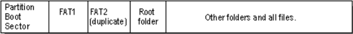<br />
_image source: `ntfs.com`_ <br />

## APFS

- default file system for macOS, iOS, tvOS and watchOS
- structured in a container, which can contain one or multiple volumes (or volume groups)
- a container is the primary object of storing data

### Structure

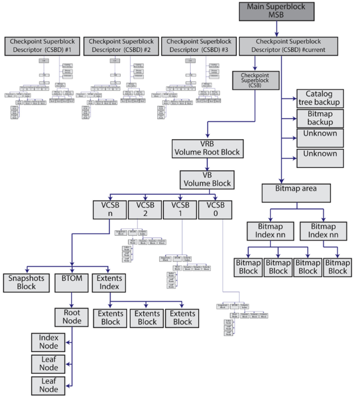 <br />
_image source: `Hansen, K. H., Toolan, F., Decoding the APFS file system, Digital Investigation (2017)`_ <br />

### Directory structure

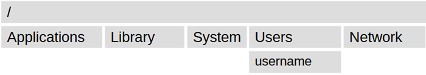

## File system examination tools

The Sleuth Kit (TSK) is a collection of command-line tools for examining disk images at the file system layer.

### fsstat (file system layer)

Displays file system metadata from the superblock: type, block size, inode count, and layout.

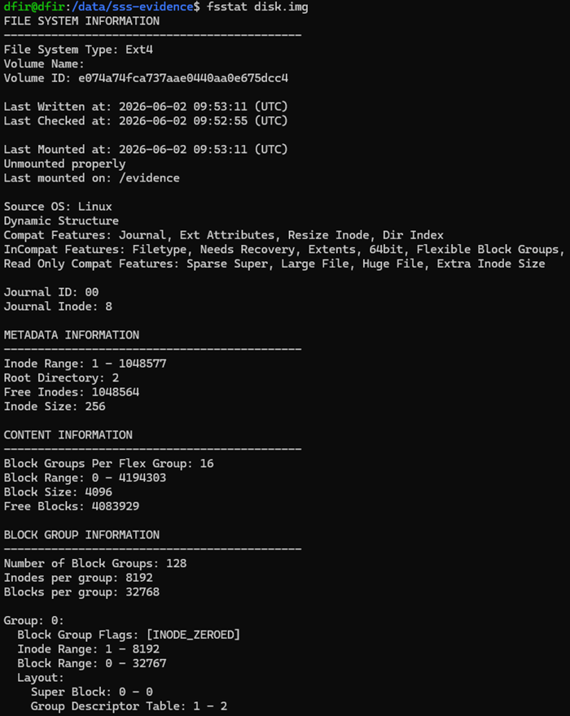

### fls (filename layer)

Lists file and directory names in a disk image, including deleted entries.

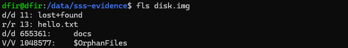

### istat (metadata layer)

Shows the inode record for a specific file: timestamps, permissions, owner, and block pointers.

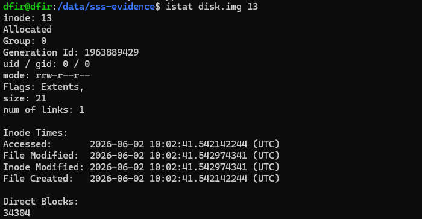

### icat (data layer)

Extracts the contents of a file by inode number.<br />


Used together, `fls` identifies files by inode, `istat` confirms the inode is still allocated on disk, and `icat` shows the contents.

## File carving

- used to extract data from unallocated space on disk, in the absence of file system metadata (for example, when an inode has been deallocated in EXT4 or an $MFT record reused in NTFS)
- carving is based on file structure (magic bytes, header, footer if it exists)
- used when simple file recovery methods fail (files are corrupted, deleted, overwritten)
- main challenges: time-consuming on large disks, false positives that need manual review

### Tools

**Foremost** carves files based on header/footer signatures defined in a config file.<br />
`foremost -t zip,pdf -i disk.img -o ./output/`

**Scalpel** is similar to foremost but faster, uses a config file (`/etc/scalpel/scalpel.conf`) where file types can be enabled by uncommenting them.<br />
`scalpel disk.img -o ./output/`

**Binwalk** is useful for finding embedded files and compressed data in binary blobs.<br />
`binwalk -e image.bin`

Hex editors can be useful for manual carving (**hexedit**, **HxD**, **Bless**, etc).<br />

**Encase** is a forensic suite of tools that includes carving capabilities.<br />

## Timestamp tampering (timestomping)

Used by attackers to modify file MACB (modification, access, change, birth) metadata to disrupt chronological timeline analysis, making a binary look like it existed on the system for years, or that a file was created during the known attack window.

- (M) Modify – Updated when the file contents are changed
- (A) Access – Updated when the file contents are accessed (usually via cli, accessing a file via GUI does not always update the access time)
- (C) Change – Metadata change time for the file i.e. file ownership change
- (B) Birth – Date the file was created. This is based on the operating system time and exists on EXT4

NTFS stores timestamps in two separate locations: `$STANDARD_INFORMATION` and `$FILE_NAME`.

`$STANDARD_INFORMATION` is visible to via `Explorer`, `dir`, or forensic viewers.
They are writable by any process using standard Windows API calls, so an unprivileged attacker can modify them.

`$FILE_NAME` is updated by the NTFS kernel driver but it's not writable via the standard API without kernel-level access.
If an attacker uses a timestomping tool, they modify $STANDARD_INFORMATION only, leaving $FILE_NAME untouched.

## Summary

- a file system is the OS layer that maps human-readable names to raw disk blocks via inodes (EXT4) or MFT records (NTFS)
- EXT4 is organized in five layers: physical, file system, filename, metadata, and data
- NTFS stores per-file metadata in the $MFT, supports alternate data streams, commonly abused to hide payloads
- FAT is simple and widely used on removable media
- APFS is the default for Apple devices
- file carving: recovers data from unallocated space when metadata is gone
- timestomping manipulates MACB timestamps to make timeline analysis harder but it is still detectable

## Drills

### snack

We recovered a small block of disk.
What's it hiding?

### time-is-relative

It seems this threat actor dropped something new, trying to blend in with the system.
But what what the real file creation time?

The flag format is SSS{yyyy-MM-dd-hh:mm:ss}

### unc

We know the victim downloaded something, but what domain did the attacker deliver the payload from?

The flag format is SSS{domainname.tld}

## Further reading

[1] Modern Operating Systems by Andrew Tanenbaum, chapter 4 File Systems <br />
[+] [Linux Forensics by Hal Pomeranz](https://archive.org/details/HalLinuxForensics/)<br />

### EXT4

[+] [Understanding EXT4 (Part 1): Extents](https://web.archive.org/web/20210618013020/https://www.sans.org/blog/understanding-ext4-part-1-extents/)<br />
[+] [Understanding EXT4 (Part 2): Timestamps](https://web.archive.org/web/20231203210836/https://www.sans.org/blog/understanding-ext4-part-2-timestamps/)<br />
[+] [Understanding EXT4 (Part 3): Extent Trees](https://web.archive.org/web/20221015052801/https://www.sans.org/blog/understanding-ext4-part-3-extent-trees/)<br />
[+] [Understanding EXT4 (Part 4): Demolition Derby](https://web.archive.org/web/20221002010854/https://www.sans.org/blog/understanding-ext4-part-4-demolition-derby/)<br />
[+] [Understanding EXT4 (Part 5): Large Extents](https://web.archive.org/web/20220630125537/https://www.sans.org/blog/understanding-ext4-part-5-large-extents/)<br />
[+] [Understanding EXT4 (Part 6): Directories](https://web.archive.org/web/20221003153121/https://www.sans.org/blog/understanding-ext4-part-6-directories/)<br />

### NTFS

[+] [NTFS overview](https://learn.microsoft.com/en-us/windows-server/storage/file-server/ntfs-overview)<br />
[+] [Another NTFS overview](https://ntfs.com/ntfs_basics.htm)<br />

### FAT

[+] [FAT overview](https://forensics.wiki/fat/)<br />

### APFS

[+] [APFS structure](https://ntfs.com/apfs-structure.htm)<br />
[+] [Sistemul de fisiere APFS](https://support.apple.com/ro-ro/guide/disk-utility/dsku19ed921c/mac)<br />
