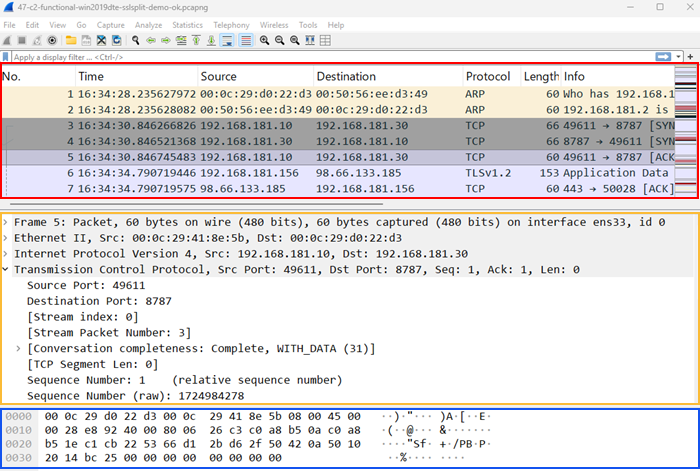

# Network analysis

Network analysis offers insight into the network activity of threat actors: initial access, the flow of traffic from a compromised host to a C2 (Command and Control) server, exfiltration.
The main challenge is sifting through vast amounts of logs.

- the network is the great equalizer
- most malware needs to communicate (except some wipers or air-gapped purposed malware)
- no matter how much time it may lie dormant, it eventually calls home to a C2 server

## Prerequisites

- a unix forensic vm with
  - tcpdump
  - wireshark
  - nice to have but not mandatory
    - zeek
    - rita

## Network evidence

Network traffic should be captured before, during and post compromise.
The rolling retention of network evidence at key points in the network architecture is recommended.

When analyzed, network evidence can give insights into:

- how the initial access was performed
- command and control activity
- if and how much data was exfiltrated
- if there was any recorded external reconnaissance (prior to initial access)
- internal lateral movement (depending on where the network evidence is collected from)

Types of network evidence:

- network log files
  - internal logs from switches, routers, firewalls, proxies, WAFs
- network traffic data
  - full packet captures, zeek logs, netflow data

Logs can be reviewed manually, filtered, or correlated in a SIEM (Security Information and Event Management) platform.
Given the amount of evidence, aggregating logs in a SIEM helps gain situational awareness faster.

Full packet captures are one of the best sources of evidence, but also one difficult to keep due to the storage cost.
Depending on regulations or internal practices, enterprise environments may keep 1 month worth of rolling pcaps, paired with 3-6-12 months of zeek logs, for example.

## Network protocols

During a breach, the same network protocols seen in normal network activity are abused by attackers.

- TCP = connection-oriented transport protocol that ensures reliable delivery of data between hosts
- UDP = connectionless transport protocol that sends packets without ensuring reliable delivery or order
- ICMP = protocol used for network troubleshooting, used by utilities like `ping` or `tracert`
- DNS = protocol that resolves domain names into IP addresses, operating over UDP or TCP
- TLS = protocol used to encrypt data to secure communications between clients and servers, operates over TCP
- HTTP = protocol used to transfer web content between clients and servers, operating over TCP
- HTTPS = encrypted version of HTTP using TLS (Transport Layer Security)

## Tcpdump, Tshark and Wireshark

Extract all packets with either src or dest 192.168.1.111 and src or dest port 443 
`tcpdump -nnr evidence.pcap host 192.168.1.111 and port 443 -w evidence-https-192.168.1.111.pcap` 
`-nn` no hostname resolution, no port resolution (sometimes another protocol than HTTPS passes through port 443) 
`-r` read from a pcap file (not live traffic) 
`-w` write to file 

Extract unique URIs 
`tshark -nnr evidence-https-192.168.1.111.pcap -Y 'http and http.user_agent' -T fields -E separator='|' -e 'ip.src' -e 'http.request.uri' | sort | uniq -c | wc -l` 
`-Y` display dilter to use 
`-T` changes the output format to specific fields only 
`-e` exact fields to display 

Extract unique `User-Agent` fields 
`tshark -nnr evidence-https-192.168.1.111.pcap -Y 'http and http.user_agent' -T fields -e 'http.user_agent' | uniq -c` 

Extract unique `URI` 
`tshark -nnr evidence-https-192.168.1.111.pcap -Y 'http and http.user_agent' -T fields -E separator='|' -e 'http.request.uri' -e 'ip.src' -e 'http.host' | sort | uniq -c | wc -l` 

### Wireshark

- first thing to do: change View > Time display format > UTC date and time of day
  - the default is seconds since beginning of capture (microsecond precision)
- second thing to do: View > Name Resolution > make sure Nothing is checked
  - disable all resolution, it can be spoofed
    - `Resolve Physical Address` labels the first 3 bytes of the MAC for the OUI name (vmware, intel)
    - `Resolve Network Address` does reverse lookups on IPs, dangerous if attacker is authoritative
    - `Resolve Transport Address` labels traffic over tcp/udp port 80 as HTTP, though traffic itself may not be HTTP

The 3 panels on the [main window](https://www.wireshark.org/docs/wsug_html_chunked/ChUseMainWindowSection.html):

- red = packet list pane
  - displays a summary of each packet captured
  - the packet you select here will be displayed in the other 2 panes
- yellow = packet details pane
  - displays the packet selected in the packet list pane in more detail
- blue = packet bytes pane
  - displays the data from the packet selected in the packet list pane
  - highlights the field selected in the packet details pane

  

## Zeek

Zeek logs keep the metadata of the traffic from the packet capture, discarding the content.
A 1GB pcap may result in 200MB worth of zeek logs, depending on on the actual traffic:

- conn.log
  - one of the most important logs
  - shows "connections" between a source and destination (including duration, bytes, state, service)
  - helps identify scanning activity, beaconing patterns, data exfiltration volumes
- dns.log
  - generated if dns data seen
  - shows dns queries and responses
  - helps identify C2 domains or DNS used for C2
- http.log
  - generated if HTTP/HTTPS seen
  - shows http requests and responses (including methods, URLs, status codes, user agents)
  - helps identify exploit delivery for initial access, or C2 beaconing over http
- ssl.log
  - generated if TLS seen
  - shows TLS handshake metadata
  - helps identify C2 encrypted beaconing over HTTPS, suspicious certificates
- files.log
  - not enabled by default
  - contains files observed in traffic if unencrypted
- weird.log
  - contains protocol anomalies, malformed packets
  - helps identify non-standard protocol abuse

Run zeek:  
`zeek -Cr evidence.pcap` 
`-C` to disable checksum verification (depending on where the packet capture is performed) 
`-r` to read from a pcap file and output the logs generated

Check logs:  
`cat conn.log | less -S` 
`cat dns.log | less -S` 
`-S` to not wrap long lines in less 

Check http logs for specific information: 
`cat http.log | zeek-cut id.orig_h id.resp_h method host uri status_code referrer user_agent | less -S` 
`zeek-cut` to extract the specific fields we are interested in 

Extract data from logs (JSON) with jq: 
`jq '[."id.orig_h",."id.resp_h",."query",."qtype_name"]' dns.log` 

## Real Intelligence Threat Analytics (RITA)

- command-line tool that analyzes network behaviour
- can process large 24h packet captures
- takes in zeek logs, imports them into a database (we chose to name it investigation)
  - `rita import *.log investigation`
- flags beaconing patterns, long connections
  - `rita show-beacons investigation`
- identify, list and sort connections with unusually high durations
  - `rita show-long-connections investigation`
- unusually high unique subdomain queries
  - `rita show-exploded-dns investigation`
- ranked list of unique user agent strings
  - `rita show-useragents`

## Arkime

- to examine large network packet captures
- organized by sessions

## Identify C2 patterns

- the act of a compromised system (client) checking in with the server for any commands is often referred to as **beaconing**
- if no commands received from the server, the client goes to sleep a set amount of time, called **sleep** time
- sleep time can vary a set % called **jitter** (ex. sleep 10s with jitter 20% -> sleep can be anything between 8-12s)
- beaconing creates regular traffic patterns that can be identified when looking at behaviour over a time range (ex. 24h)

Protocols used for C2 communication:

- HTTP/HTTPS = the most common, blends in with normal traffic that flows in an enterprise environment
- DNS = commonly used but suspicious traffic can be identified (abnormally large number of requests to the same domain, abusing [TXT, CNAME, NS, MX](https://www.activecountermeasures.com/a-network-threat-hunters-guide-to-dns-records/) records)
- ICMP = not very common as it's immediately suspicious to see large amounts of ICMP requests to remote hosts
- SMB = used to pivot peer-to-peer in windows environments, does not cross external network boundaries

With an additional layer of abstraction, C2s can also be achieved via applications, like the Google suite (Calendar, Drive, etc.), Discord, Velociraptor and many others, but they are outside the scope of this class.

## Identify initial access

- identify connections to exposed services (VPN, SSH, RDP, HTTP/HTTPS)
- DNS requests to unusual domains
- connections not preceded by a DNS query, regular users rarely ever access a resource directly by IP
- unusual inbound connections, high volume of failed logins
- unexpected protocol versions or sequence anomalies
- http status manipulation where 4xx errors still deliver payloads
  - `cat http.log | zeek-cut method host uri user_agent status_code response_body_len`

## Identify data exfiltration

- large volumes of bytes seen outbound to suspicious destinations in zeek logs or packet captures
- outbound HTTP/S `POST` requests with large payloads or to unusual URLs
- unusual FTP/FTP usage
- unauthorized cloud storage uploads

## Summary

- when properly configured network logs record all communication
- evidence: full packet captures, zeek logs, internal appliance logs
- protocols: tcp, udp, icmp, dns, tls, http/s
- tcpdump, tshark, wireshark, zeek help investigate further
- look for data exfil, c2 and initial access

## Drills

### Challenge 1

Description

### Challenge 2

Description

### Challenge 3

Description

## Further reading

[+] [Open source SIEM - Wazuh](https://github.com/wazuh/wazuh) 
[+] [Wireshark - The Main window](https://www.wireshark.org/docs/wsug_html_chunked/ChUseMainWindowSection.html) 
[+] [Zeek](https://github.com/zeek/zeek) 
[+] [RITA](https://github.com/activecm/rita) 
[+] [A Network Threat Hunter’s Guide to DNS Records](https://www.activecountermeasures.com/a-network-threat-hunters-guide-to-dns-records/) 
[+] [Detecting DNS C2](https://www.activecountermeasures.com/malware-of-the-day-encrypted-dns-comparison-detecting-c2-when-you-cant-see-the-queries/) 
